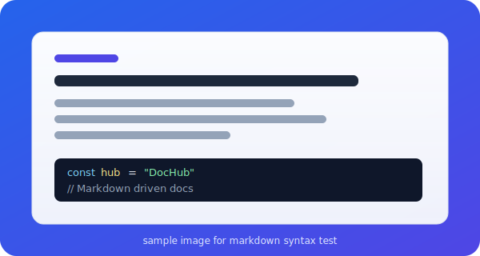

Markdown HubはAstroとTailwind CSSを使用して構築されたドキュメントサイトテンプレートです。

QuiitaやZennに投稿するのは恥ずかしいけど、自分が作成したいろいろな作品の内容をMarkdownでまとめてみんなに見てもらいたいな、という人向けのテンプレートです。

## 特徴

以下のような機能を備えています。

- **GFM対応**: テーブル、タスクリスト、打ち消し線など、GitHubで馴染みのある記法をサポート
- **シンタックスハイライト**: Shikiを利用した美しいコード表示
- **自動サイドバー**: `src/pages` 内のMarkdownを自動で収集
- **自動目次 (TOC)**: ページ内の見出しから目次を自動生成
- **レスポンシブレイアウト** – モバイルフレンドリーなフォールバック付き。

## 記法のテスト

### 1. コードハイライト

JavaScriptのサンプルコードです。Astroで設定されたShikiによりハイライトされます。

```javascript
// Greeting function
function greet(name) {
  console.log(`Hello, ${name}!`);
}

greet('World');
```

### 2. テーブル (表)

設定項目の一覧などを表で表現できます。

| 項目名 | 型 | 説明 |
| :--- | :--- | :--- |
| `site` | `string` | サイトのベースURLを設定します。 |
| `base` | `string` | リポジトリ名に基づくパスを設定します。 |
| `integrations` | `array` | Astro統合のリスト（Tailwindなど） |

### 3. タスクリスト

TODOの管理などに使えます。

- [x] Astroプロジェクトのセットアップ
- [x] Tailwind CSSの統合
- [ ] ダークモードの対応（将来の課題）
- [ ] 検索機能の追加

### 4. 取り消し線と装飾

テキストの一部を強調したり、~~無効なテキスト~~を表現したりできます。

### 5. 引用 (Blockquote)

> 設定の変更後は、必ず開発サーバーを再起動してください。
> 再起動しないと反映されない場合があります。

### 6. 画像

`src/pages/images/` に配置した画像を相対パスで参照できます。Astroがビルド時に最適化してくれます。


